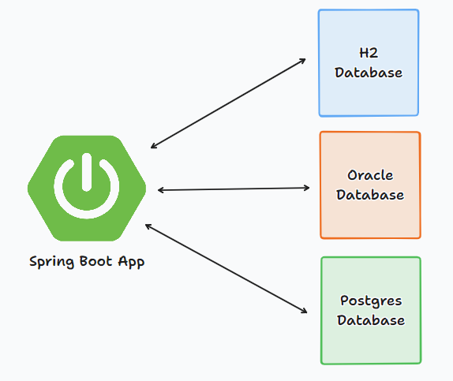

# Spring Boot + Multiple Data Sources
Simple Spring Boot application demonstrates how to multiple data sources.
The following CRUD operations are exposed:

* find all books
* find all libraries
* find all customers
* get a book by `id`
* get a library by `id`
* get a customer by `id`

----------------------------------------------------
### Pre-requisite

* JDK 21
* IntelliJ IDE
* Oracle DB
* PostgresDB

----------------------------------------------------
### Introduction



The typical scenario for a Spring Boot application is to store data in a single relational database. But we sometimes need to access multiple databases.
For that purpose in this application is demonstrated how to configure and use multiple data sources using `Spring Boot 3.2`, `JDK 21` and `JdbcClient`.
The following databases are used in this application:

* `H2 Embedded` (created at runtime)
* `Oracle DB`
* `Postgres DB`

Each of the databases has appropriate configuration in the `application.yml` file, and appropriate `schema.sql` placed in the `resources` folder.
When the app is started, the appropriate database tables are created and populated with initial data.

----------------------------------------------------
### Building and running
To build and run the application, execute the following commands:
```
mvn clean package
```

```
mvn spring-boot:run
```
----------------------------------------------------
### CRUD Endpoints

* Get all books from H2 database
```
GET -> http://localhost:8080/api/books
```

* Get a book by `id` from H2 database
```
GET -> http://localhost:8080/api/books/{id}
```

* Get all libraries from Oracle database
```
GET -> http://localhost:8080/api/libraries
```

* Get a library by `id` from Oracle database
```
GET -> http://localhost:8080/api/libraries/{id}
```

* Get all customers from Postgres database
```
GET -> http://localhost:8080/api/customers
```

* Get a customer by `id` from Postgres database
```
GET -> http://localhost:8080/api/customers/{id}
```
